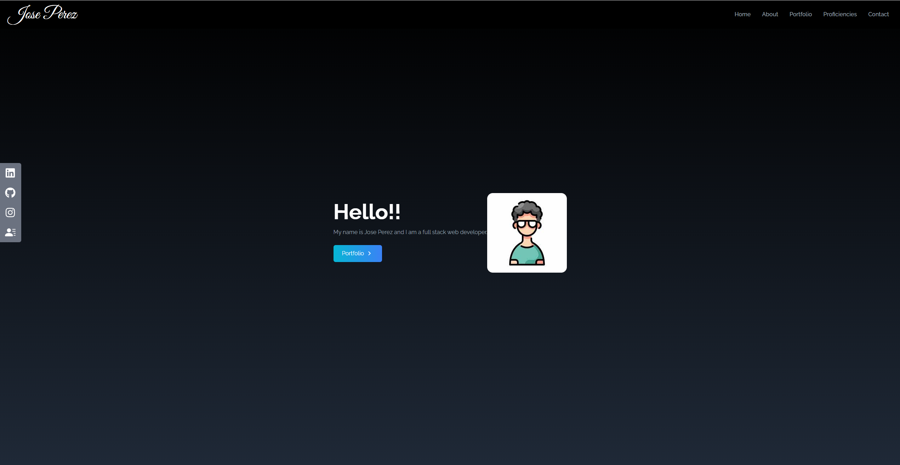
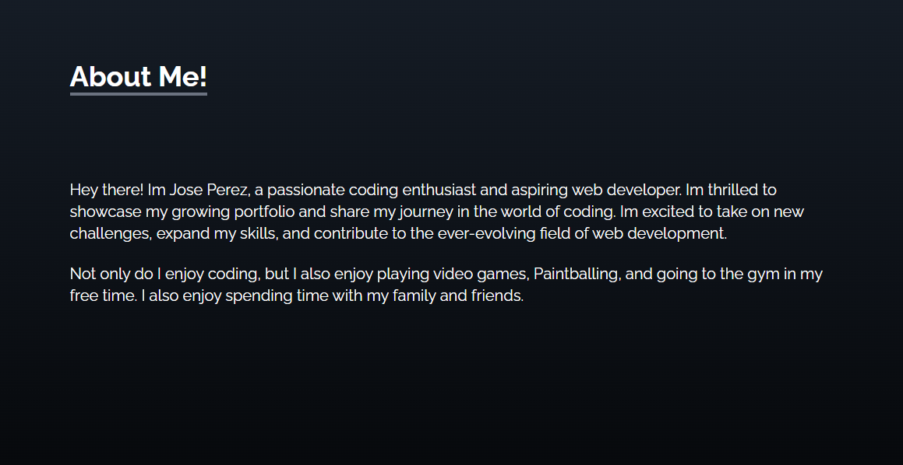
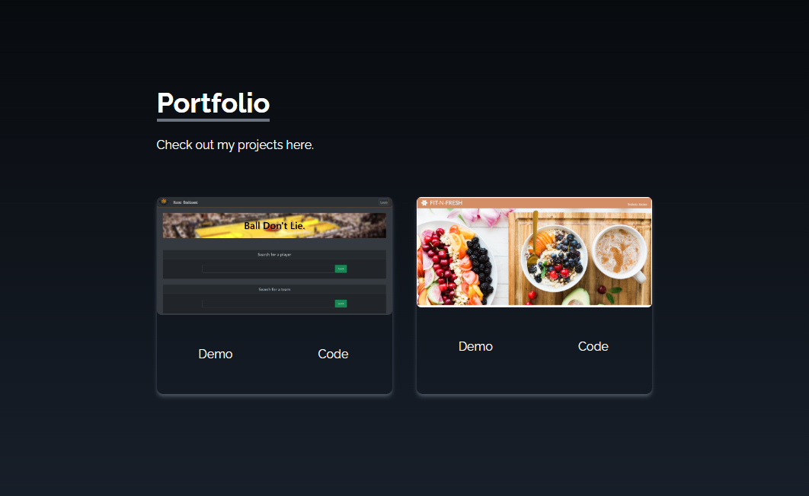
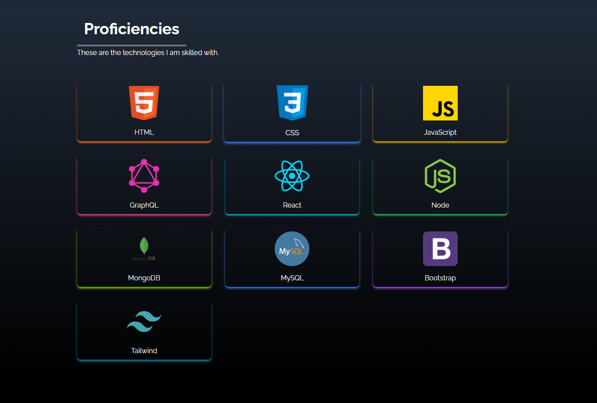
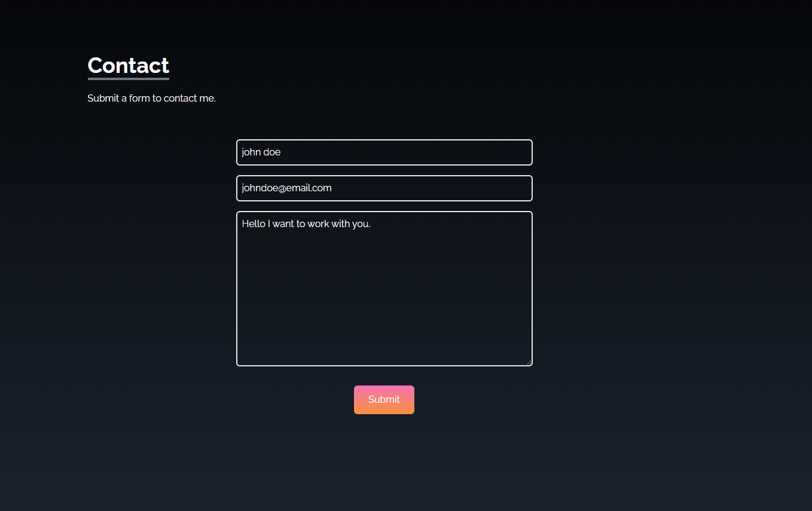

# My React Portfolio

## Description

- A front-end portfolio I built using React and Tailwind CSS.
- I can use this project to present my skills in React along with my skills as a modern front-end developer to future employers.

## Installation

- No installation is needed. [Click here to visit the app.](https://main--clever-llama-e309a0.netlify.app/)

## Usage

- Upon opening the app link, you will be presented with my "Home" page.
- Clicking on any of the 5 links in the "Navbar" will take you to their respective routes.
- Clicking on the "Portfolio" button will take you to my projects.

- On the left side of the page, there are 4 links. Clicking on them will either take you to my Linkedin, Github, Instagram, and the 4th will open up my "Resume".

- On the "About Me" page, I have a description of myself and what I like to do on days off.

- On the "Portfolio" Page, I have my latest Projects along with their respective web links and repository links.

- On my "Proficiencies" page, I have icons of the technologies I am most skilled with.

- On my "Contact" page, you can send me a message through the form.

## Credits

- All of the Styling was made using [Tailwind CSS](https://tailwindcss.com/).

- [Jeff Patterson](https://github.com/jpatterson933) was a big help in deploying this application.

## License

MIT License

Copyright (c) 2023 JosePerez013

Permission is hereby granted, free of charge, to any person obtaining a copy of this software and associated documentation files (the "Software"), to deal in the Software without restriction, including without limitation the rights to use, copy, modify, merge, publish, distribute, sublicense, and/or sell copies of the Software, and to permit persons to whom the Software is furnished to do so, subject to the following conditions:

The above copyright notice and this permission notice shall be included in all copies or substantial portions of the Software.

THE SOFTWARE IS PROVIDED "AS IS", WITHOUT WARRANTY OF ANY KIND, EXPRESS OR IMPLIED, INCLUDING BUT NOT LIMITED TO THE WARRANTIES OF MERCHANTABILITY, FITNESS FOR A PARTICULAR PURPOSE, AND NONINFRINGEMENT. IN NO EVENT SHALL THE AUTHORS OR COPYRIGHT HOLDERS BE LIABLE FOR ANY CLAIM, DAMAGES, OR OTHER LIABILITY, WHETHER IN AN ACTION OF CONTRACT, TORT, OR OTHERWISE, ARISING FROM, OUT OF, OR IN CONNECTION WITH THE SOFTWARE OR THE USE OR OTHER DEALINGS IN THE SOFTWARE.
